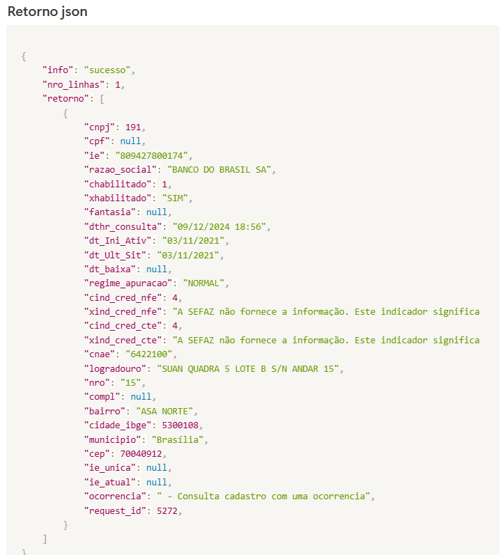

# Integração da API SINTEGRA em Python – Consulta de Inscrição Estadual em tempo real

Consulta de dados cadastrais no SINTEGRA por UF utilizando a API SINTEGRA ArquivoNFe.

## 🔎 Palavras-chave

- API SINTEGRA
- Consulta SINTEGRA
- SINTEGRA CCC
- Consulta Inscrição Estadual
- API Fiscal Brasil

Permite realizar consultas por **CNPJ, CPF ou Inscrição Estadual (IE)**, conforme a UF informada.

## Benefícios

✔ Consulta por CNPJ, CPF ou IE  
✔ Dados cadastrais retornados pela API  
✔ Integração simples via API REST  
✔ Processamento assíncrono com `request_id`

## Casos de uso

✔ Validação antes da emissão de NF  
✔ Conferência cadastral automática  
✔ Verificação de informações cadastrais  
✔ Processos de KYC (Know Your Customer)

## Diferenciais

✔ Consulta realizada junto à fonte oficial disponibilizada para a UF consultada.  
✔ Comunicação segura via HTTPS.  
✔ Servidor hospedado na Oracle Cloud no Brasil.  
✔ Painel de controle web para configurações, consultas manuais e acompanhamento das integrações via API.  
✔ Consulta por CNPJ, CPF ou IE, conforme a documentação da API.

<br>

## 🚀 Requisitos

- Windows ou Linux
- Python 3.x
- Biblioteca `requests`

<br>

## ⚙️ Como utilizar

### 1️⃣ Cadastre-se gratuitamente

Acesse o portal:

https://portal.arquivo-nfe.com

---

### 2️⃣ Copie seu Token

Após o login no portal:

Acesse o menu **Meu Token**.

Copie o seu token de acesso.

> ⚠️ **Nunca publique seu token de acesso no GitHub.**

---

### 3️⃣ Instalação do Python

O exemplo utiliza **Python 3**.

#### Windows

Baixe o Python pelo site oficial:

https://www.python.org/downloads/windows/

Durante a instalação, marque a opção:

**Add python.exe to PATH**

Depois de concluir a instalação, abra o **Prompt de Comando (CMD)** e execute:

```bash
python --version
```

O comando deverá apresentar a versão instalada, por exemplo:

```bash
Python 3.13.x
```

#### Linux

Verifique se o Python 3 está instalado:

```bash
python3 --version
```

Caso não esteja instalado, utilize o gerenciador de pacotes da sua distribuição.

Por exemplo, no Ubuntu/Debian:

```bash
sudo apt update
sudo apt install python3 python3-pip python3-venv
```

Depois confirme:

```bash
python3 --version
```

### 4️⃣ Instalação das dependências

O exemplo utiliza a biblioteca `requests` para realizar as chamadas à API.

No Windows, abra o **Prompt de Comando (CMD)** e acesse a pasta onde está o projeto.

Instale as dependências utilizando:

```bash
pip install -r requirements.txt
```

Depois da instalação, você pode verificar se a biblioteca `requests` está disponível:

```bash
pip show requests
```

No Linux, utilize:

```bash
pip3 install -r requirements.txt
```

### 5️⃣ Script Python

Em breve.

---

## 📘 Documentação completa

Mais detalhes em:

https://www.arquivo-nfe.com/api-sintegra-ccc-excel

---

## 📄 Exemplo de retorno da API



---

## 🔗 Documentação da API

https://www.arquivo-nfe.com/api-sintegra-ccc

---

## ⭐ Apoie o projeto

Se este projeto foi útil para você:

⭐ **Deixe uma estrela no repositório**

Isso ajuda outras pessoas a encontrarem o projeto.

---

Made with ❤️ by **ArquivoNfe**

https://www.arquivo-nfe.com
