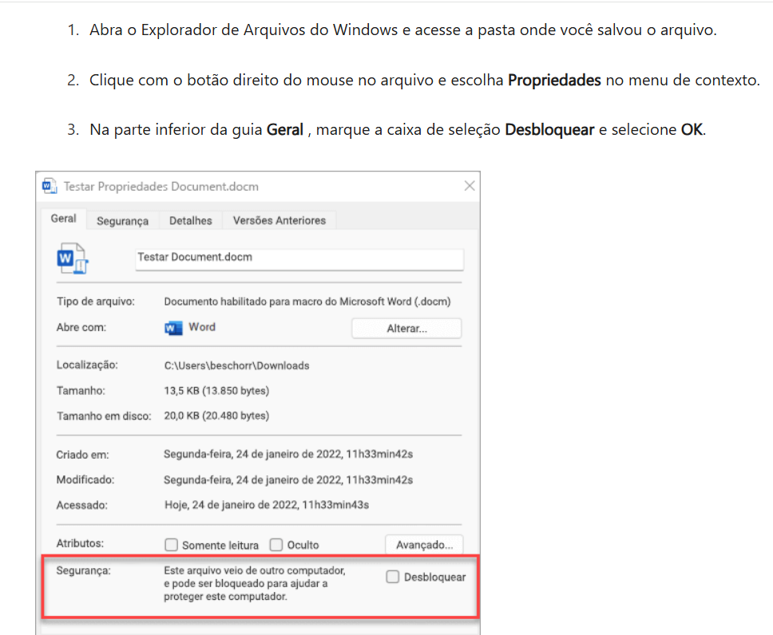
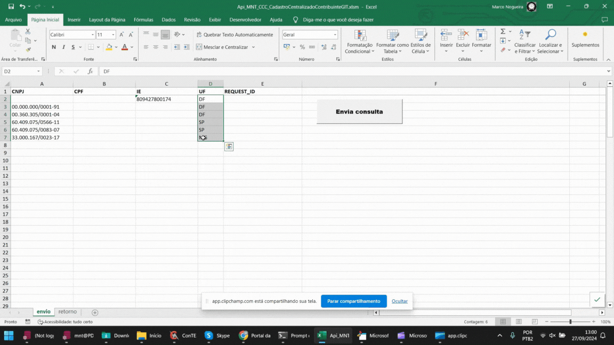
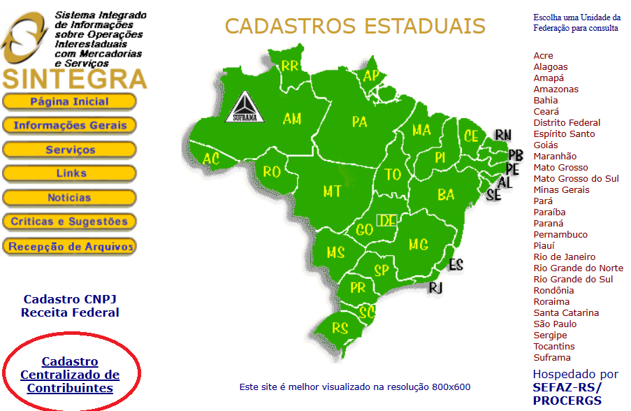

# Integração da API SINTEGRA em Python – Consulta de Inscrição Estadual em tempo real

Valide a situação fiscal de contribuintes diretamente nas SEFAZ estaduais com alta confiabilidade.

Integração com as APIs do portal **arquivo-nfe.com**.

## 🔎 Palavras-chave

- API Sintegra
- Consulta Sintegra
- Sintegra CCC
- Consulta Inscrição Estadual
- API Fiscal Brasil

Integre seu sistema Python a automatização de validação cadastral de contribuintes em tempo real, consultando diretamente as fontes oficiais das SEFAZ estaduais.

Com uma interface intuitiva, permite a consulta simultânea de múltiplos CNPJs, CPF´s ou IE´s de acordo com suas necessidades.

<b>Benefícios</b>
✔ Consulta por CNPJ, CPF ou IE
✔ Dados atualizados em tempo real
✔ Integração simples via API REST

<b>Casos de uso</b>
✔ Validação antes da emissão de NF
✔ Conferência cadastral automática
✔ Verificação de regime tributário
✔ Processos de KYC (Know Your Customer)

<b>Diferenciais</b>
✔ Consulta realizada em tempo real na fonte pública oficial.
✔ Acesso seguro via https em servidor Oracle Cloud Brasil, com alta performance e baixa latência. Seguro e criptografado, atendendo as boas práticas de segurança da informação de acordo com a legislação vigente.
✔ Painel de controle web para configurações, consultas manual e acompanhamento das integrações via API
✔ Consulta por CNPJ, CPF, IE e UF

 

<h3>🚀 Tecnologias Utilizadas</h3> 

Python, e API Sintegra ArquivoNfe API Plataform

 

<h3>📂 Estrutura do Projeto</h3>

Api_MNT_Consulta_Sintegra_e_CNPJ_Receita.xlsm

 

---

## ⚙️ Como utilizar

### 1️⃣ Cadastre-se gratuitamente

Acesse o portal:

https://portal.arquivo-nfe.com

---

### 2️⃣ Copie seu Token

Após login no portal:

Menu **Meu Token**

Copie o **código de cliente**.

---

### 3️⃣ Baixe a planilha

Faça download da planilha:

https://www.arquivo-nfe.com/api-sintegra-e-cnpj-receita-excel

Na guia **Configuração**, informe seu **token de acesso à API**.

---

### 4️⃣ Habilite as macros no Excel

Para permitir a integração com as APIs:

---

## 📘 Documentação completa

Mais detalhes em:

https://www.arquivo-nfe.com/api-sintegra-ccc-excel

---

## 🎥 Demonstração

Execute o GIF abaixo para visualizar o funcionamento:

---

# 🌐 API Sintegra Unificado

A **API Sintegra / Cadastro Centralizado de Contribuintes (CCC)** automatiza a validação de informações fiscais durante:

- cadastro de clientes
- cadastro de fornecedores
- emissão de nota fiscal

A consulta é realizada em **tempo real** na fonte pública oficial mantida pela **SEFAZ RS em conjunto com as demais SEFAZ estaduais**.

---

## 💼 Usos comuns

✔ Verificar situação do contribuinte antes da emissão de notas fiscais  
✔ Alternativa à consulta manual no SINTEGRA estadual  
✔ Gestão cadastral e fiscal  
✔ Validação de dados fiscais de empresas  
✔ Verificação de regime tributário  
✔ Criação de dossiês e processos de **KYC (Know Your Customer)**  

---

## 📄 Exemplo de retorno da API

---

## 🔗 Documentação da API

https://www.arquivo-nfe.com/api-sintegra-ccc

---

## ⭐ Apoie o projeto

Se este projeto foi útil para você:

⭐ **Deixe uma estrela no repositório**

Isso ajuda outras pessoas a encontrarem o projeto.

---

## 📝 Licença

🚀 Aproveite o **Plano FREE** das APIs **Sintegra Unificado** e **CNPJ Receita**.

---

Made with ❤️ by **ArquivoNfe**

https://www.arquivo-nfe.com
